<div align="center">


# Tree of Knowledge

### Heart of Programming — interactive map of all CanonEngineer code


**Repositório central onde cada projeto vira uma árvore dimensional com nós de código, hover explicativo e modal de implementação.**

<br><br>

---

### 🚀 Acessar a Árvore do Conhecimento

<p>
  <a href="https://canonengineer.github.io/TreeofKnowledge/">
    
  </a>
  &nbsp;&nbsp;&nbsp;
  <a href="https://github.com/CanonEngineer/TreeofKnowledge#-documentação-do-repositório">
    
  </a>
</p>

<p>
  <strong>Conectar</strong> → abre a experiência interativa em
  <a href="https://canonengineer.github.io/TreeofKnowledge/"><code>canonengineer.github.io/TreeofKnowledge</code></a><br>
  <strong>Cancelar</strong> → permanece nesta página do repositório
</p>

---

[Sobre](#-sobre) •
[Projetos](#-projetos-mapeados) •
[Arquitetura](#-arquitetura) •
[Fluxos](#-fluxogramas) •
[Como usar](#-como-usar) •
[Estrutura](#-estrutura-de-arquivos) •
[Autor](#-autor)

</div>

---

## 📌 Sobre

A **Árvore do Conhecimento** é o hub central de todos os projetos do **CanonEngineer**. Cada repositório foi analisado e transformado em uma **árvore interativa** onde:

| Ação | Resultado |
|------|-----------|
| **Raiz (nó dourado)** | Nome do projeto de origem |
| **Hover no nó** | Tooltip com nome + o que o código faz |
| **Clique no balão** | Abre **página dedicada** (`node.html`) com código e implementação |
| **Barra de busca** | Pesquisa em todos os projetos por código, função ou arquivo |
| **Voltar** | Retorna à árvore do projeto |

> Daqui saem todos os projetos — cada nó é código **criado por mim**, não boilerplate genérico.

<div align="center">

<p>
  <a href="https://canonengineer.github.io/TreeofKnowledge/">
    
  </a>
</p>

</div>

---

## 📸 Ilustrações

### 1 — Galeria de projetos

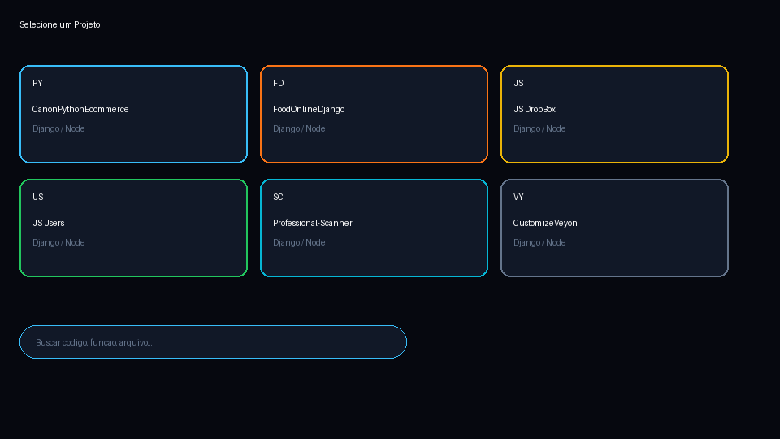

### 2 — Árvore interativa (clique no balão → página do código)

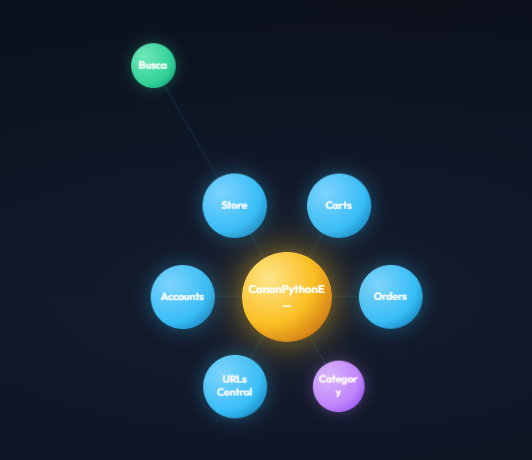

### 3 — Página do nó (código + explicação embutidos)

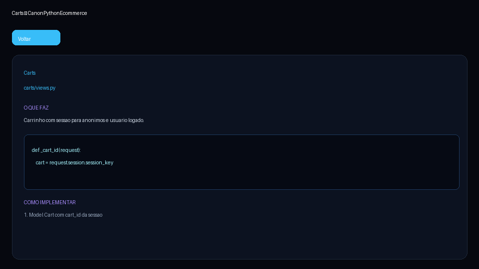

### Fluxo da jornada

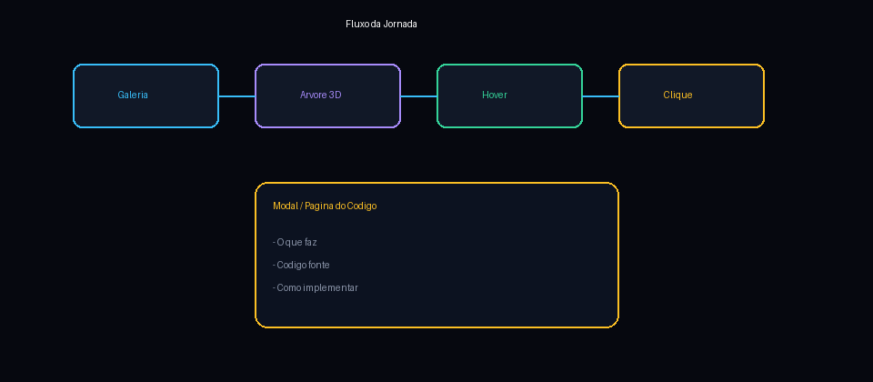

### Arquitetura do sistema

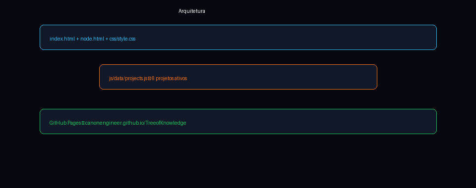

### Camadas dos nós

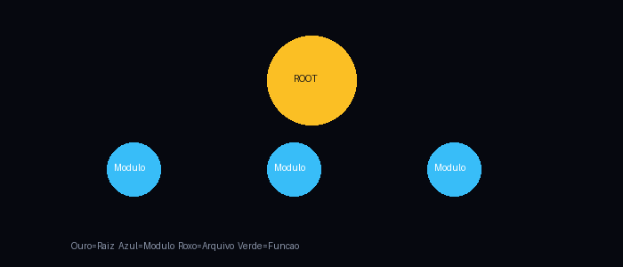

---

## 🗂️ Projetos mapeados

| # | Projeto | Stack | Nós | Repositório |
|---|---------|-------|-----|-------------|
| 1 | **CanonPythonEcommerce** | Django 5 + PayPal | 23 | [CanonPythonEcommerce](https://github.com/CanonEngineer/CanonPythonEcommerce) |
| 2 | **FoodOnlineDjango** | Django + PostGIS + RazorPay | 20 | [FoodOnlineDjango](https://github.com/CanonEngineer/FoodOnlineDjango) |
| 3 | **JavaScriptDropBoxProject** | Express + Firebase | 38 | [JavaScriptDropBoxProject](https://github.com/CanonEngineer/JavaScriptDropBoxProject) |
| 4 | **JavaScriptRestaurantProject** | Express + EJS + MySQL + Redis | 31 | [JavaScriptRestaurantProject](https://github.com/CanonEngineer/JavaScriptRestaurantProject) |
| 5 | **JavaScriptUsersProject** | ES6 + localStorage | 20 | [JavaScriptUsersProject](https://github.com/CanonEngineer/JavaScriptUsersProject) |
| 6 | **JavaScriptRestfulApiProject** | Express + NeDB | 20 | [JavaScriptRestfulApiProject](https://github.com/CanonEngineer/JavaScriptRestfulApiProject) |
| 7 | **Professional-Scanner** | Node.js + WebSocket | 20 | [Professional-Scanner](https://github.com/CanonEngineer/Professional-Scanner) |
| 8 | **CustomizeVeyonProject** | Qt/C++ Veyon CIMED | 45 | [CustomizeVeyonProject](https://github.com/CanonEngineer/CustomizeVeyonProject) |

---

## 🏗️ Arquitetura

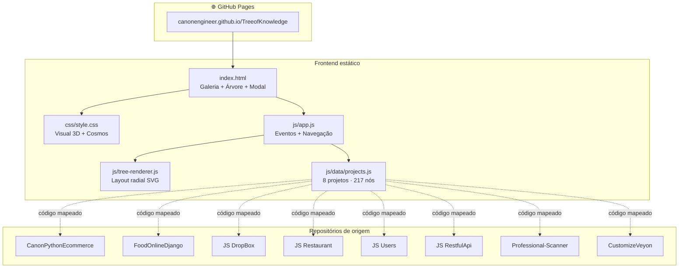

---

## 🔀 Fluxogramas

### Fluxo principal — da galeria ao código

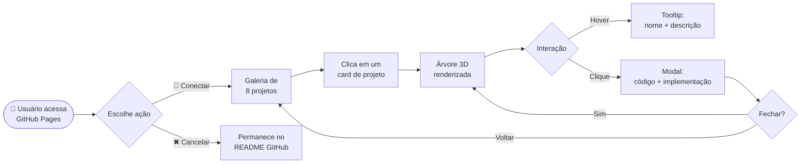

### Fluxo de um nó da árvore

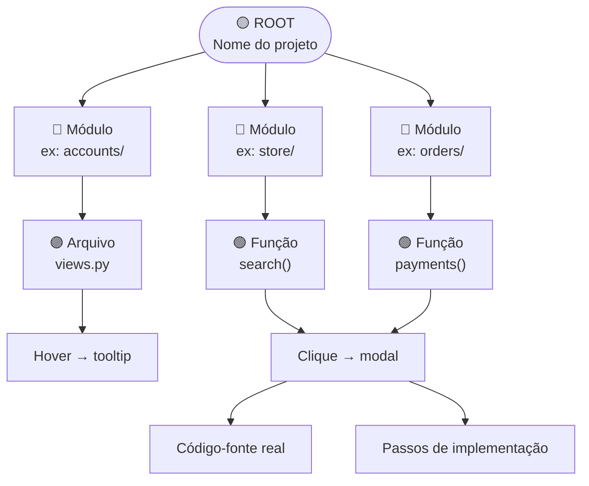

### Fluxo de dados — `projects.js`

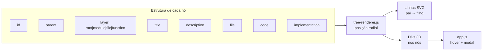

### Mapa dos ecossistemas

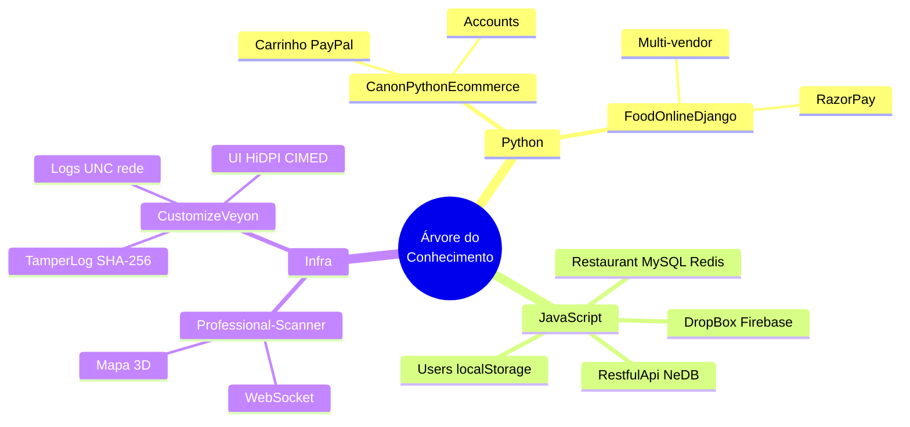

---

## 🎮 Como usar

### Opção 1 — Experiência completa (recomendado)

<div align="center">

<a href="https://canonengineer.github.io/TreeofKnowledge/">
  
</a>

</div>

1. Clique em **Conectar** acima
2. Escolha um dos **8 projetos** na galeria
3. Explore a **árvore dimensional** — mova o mouse para o efeito 3D
4. **Passe o mouse** nos balões para ver o que cada código faz
5. **Clique no balão** para abrir a **página com código e implementação**
6. Use a **barra de busca** no topo para encontrar qualquer trecho de código
7. **Voltar à Árvore** retorna ao projeto · **Voltar aos Projetos** retorna à galeria

### Opção 2 — Permanecer no GitHub

<div align="center">

<a href="https://github.com/CanonEngineer/TreeofKnowledge#-documentação-do-repositório">
  
</a>

</div>

Navegue pela documentação, fluxogramas e tabelas deste README sem sair do GitHub.

### Opção 3 — Local

```bash
git clone https://github.com/CanonEngineer/TreeofKnowledge.git
cd TreeofKnowledge
# Abra index.html no navegador
```

---

## 📁 Estrutura de arquivos

```
TreeofKnowledge/
├── index.html              # Galeria + árvore + busca
├── node.html               # Página dedicada do nó (código + implementação)
├── css/style.css
├── js/
│   ├── app.js              # Galeria, árvore, navegação
│   ├── node-page.js        # Renderiza página do nó
│   ├── search.js           # Busca global na árvore
│   ├── tree-renderer.js
│   └── data/projects.js
```

---

## 🎨 Design

| Elemento | Descrição |
|----------|-----------|
| **Fundo cosmos** | Estrelas animadas + nebulosa azul/roxa |
| **Perspectiva 3D** | `perspective` + rotação no movimento do mouse |
| **Nós dourados** | Raiz = nome do projeto |
| **Nós azuis** | Módulos (apps, controllers) |
| **Nós roxos** | Arquivos |
| **Nós verdes** | Funções e métodos |
| **Linhas SVG** | Conexões pai → filho com glow |
| **Canon Evolution** | Núcleo 3D com cubo de código, anéis orbitais e partículas no header |
| **Modal** | Código em JetBrains Mono + passos numerados |

---

## 📋 Documentação do repositório

Esta seção é o destino do botão **Cancelar** — você permanece aqui no GitHub.

### Links rápidos

| Recurso | URL |
|---------|-----|
| 🌳 **Árvore interativa** | [canonengineer.github.io/TreeofKnowledge](https://canonengineer.github.io/TreeofKnowledge/) |
| 📦 **Repositório** | [github.com/CanonEngineer/TreeofKnowledge](https://github.com/CanonEngineer/TreeofKnowledge) |
| 👤 **Perfil CanonEngineer** | [github.com/CanonEngineer](https://github.com/CanonEngineer) |

### Convenções dos nós

Cada entrada em `js/data/projects.js` segue:

```javascript
{
  id: 'cpe-root',
  parent: null,           // null = raiz
  layer: 'root',          // root | module | file | function
  title: 'CanonPythonEcommerce',
  description: '...',     // hover
  file: 'greatkart/urls.py',
  code: '...',            // código real
  implementation: ['...'] // passos PT
}
```

---

## 👤 Autor

**Alessandro Canon** — [CanonEngineer](https://github.com/CanonEngineer)

<div align="center">

<br>

### Pronto para explorar?

<p>
  <a href="https://canonengineer.github.io/TreeofKnowledge/">
    
  </a>
  &nbsp;&nbsp;
  <a href="https://github.com/CanonEngineer/TreeofKnowledge">
    
  </a>
</p>

<sub>Tree of Knowledge — base de conhecimento estruturada para todos os projetos CanonEngineer</sub>

</div>
